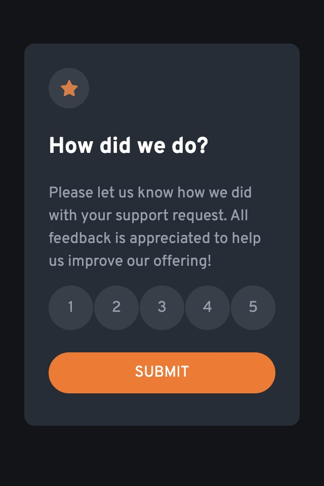

# Frontend Mentor - Interactive rating component solution

This is a solution to the [Interactive rating component challenge on Frontend Mentor](https://www.frontendmentor.io/challenges/interactive-rating-component-koxpeBUmI). Frontend Mentor challenges help you improve your coding skills by building realistic projects. 

## Table of contents

- [Overview](#overview)
  - [The challenge](#the-challenge)
  - [Screenshot](#screenshot)
  - [Links](#links)
- [My process](#my-process)
  - [Built with](#built-with)
  - [Continued development](#continued-development)
- [Author](#author)

## Overview

### The challenge

Users should be able to:

- View the optimal layout for the app depending on their device's screen size
- See hover states for all interactive elements on the page
- Select and submit a number rating
- See the "Thank you" card state after submitting a rating

### Screenshot

### Links

- Solution URL: [https://github.com/webdevbynight/interactive-rating-component-main](https://github.com/webdevbynight/interactive-rating-component-main)
- Live Site URL: [https://webdevbynight.github.io/interactive-rating-component-main/](https://webdevbynight.github.io/interactive-rating-component-main/)

## My process

### Built with

- Semantic HTML5 markup
- CSS (via SCSS)
  - custom properties
  - pseudo-classes
  - pseudo-elements
  - CSS sprite
  - flexbox
- Mobile-first workflow

### Continued development

Even if I did not feel I spent too much time carrying out this challenge, I still have to learn about how to make front-end development in a more efficient way and to learn to manage to build web pages without seeming to be too slow.

## Author

- Website - [@webdevbynight](https://github.com/webdevbynight)
- Frontend Mentor - [@webdevbynight](https://www.frontendmentor.io/profile/webdevbynight)
